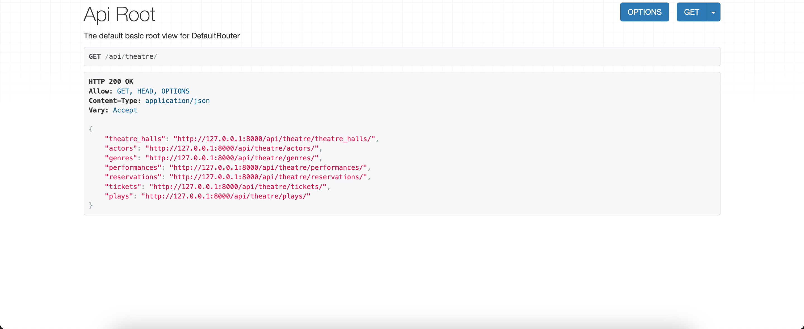

# Theatre API
API service for theatre management written on DRF

### Installing using GitHub
Python3 must be already installed. Install PostgresSQL and create db.


```shell
git clone https://github.com/asdadaversa/theatre-api-service.git
cd theatre-api-service
python3 -m venv venv
venv\Scripts\activate (on Windows)
source venv/bin/activate (on macOS)
pip install -r requirements.txt
```

### Environment Variables Setup
1. Create a `.env` file in the root directory of your project.
2. Set up it as in '.env.sample'
```
SECRET_KEY=SECRET_KEY
POSTGRES_HOST=POSTGRES_HOST
POSTGRES_DB=POSTGRES_DB
POSTGRES_USER=POSTGRES_USER
POSTGRES_PASSWORD=POSTGRES_PASSWORD
DB_PORT=DB_PORT
```

### Next run migrations and run server

```bash
$ python manage.py makemigrations
$ python manage.py migrate
$ python manage.py runserver

```


## Use the following command to load prepared data from fixture:

`python manage.py loaddata db_data.json`

- After loading data from fixture you can use following superuser (or create another one by yourself):
  - email: `admin@pes.com`
  - Password: `Qwerty.1`


## Run with docker
Docker should be installed
```
set up your .env for docker, for e.g.
POSTGRES_HOST=db
POSTGRES_DB=app
POSTGRES_USER=postgres
POSTGRES_PASSWORD=secretpassword

next run:
- docker-compose build
- docker-compose up

Use the following command to load prepared data from fixture for docker:
docker-compose run app sh -c "python manage.py test theatre/tests"

```


## Getting access:
  - Create user - /api/user/register
  - Get access token - /api/user/token

You can load ModHeader extension for your browser and add request header (JWT). Example:
  - key: Authorization

  - value:Bearer eyJhbGciOiJIUzI1NiIsInR5cCI6IkpXVCJ9

## Features
- JWT authenticated
- Admin panel /admin/
- Documentation is located at /api/doc/swagger/
- Managing reservations ant tickets
- Creating plays with genres and actors
- Creating theatre halls
- Adding performances
- Filtering plays and performances



